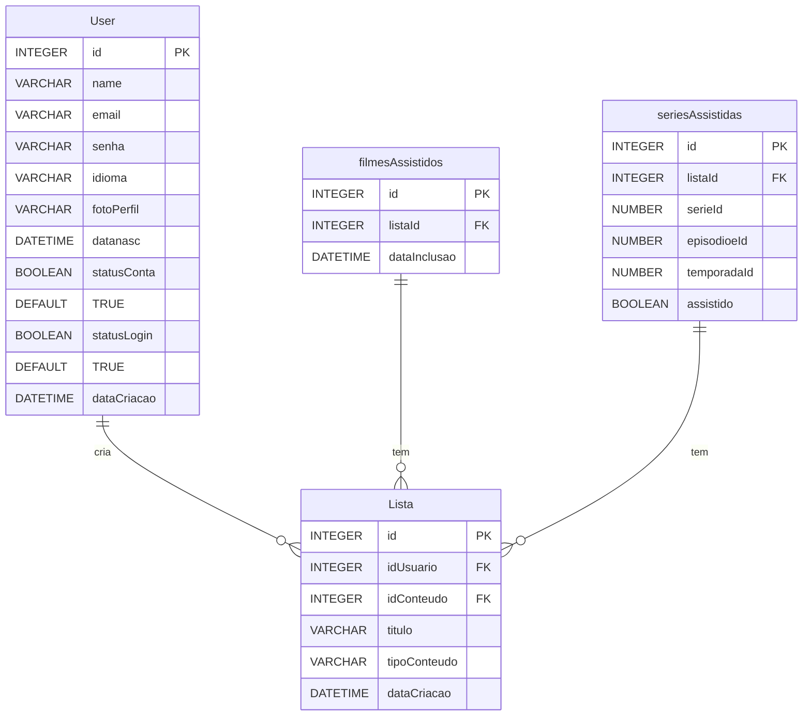

# 1. Desinstalar o Expo CLI

Rodar o comando `npm uninstall -g expo-cli`. Depois de rodar o comando, é uma boa prática verificar se o Expo foi realmente removido, executando: `expo --version`. Se o Expo foi removido corretamente, esse comando retornará algo como command not found ou uma mensagem de erro.

# 2. Limpar o Cache do NPM (opcional, mas recomendado)

Em alguns casos, pode ser necessário limpar o cache do npm para evitar problemas de versões antigas de pacotes, especialmente se você tiver encontrado problemas com dependências corrompidas Execute o seguinte comando para limpar o cache do npm: `npm cache clean --force`.

# 3. Reinstalar o Expo CLI

Agora, para instalar novamente o Expo CLI, basta rodar o seguinte comando: `npm install -g expo-cli`

# 4. Verificar a Instalação

Para verificar se o Expo foi instalado corretamente, execute: `expo --version`.

# 5. Rodar o Projeto Novamente

- Navegue até a pasta do seu projeto: `cd /caminho/para/seu/projeto`
- Se necessário, instale as dependências do projeto: `npm install`
- Rodar o projeto: `expo start`

# Diagrama banco de dados

